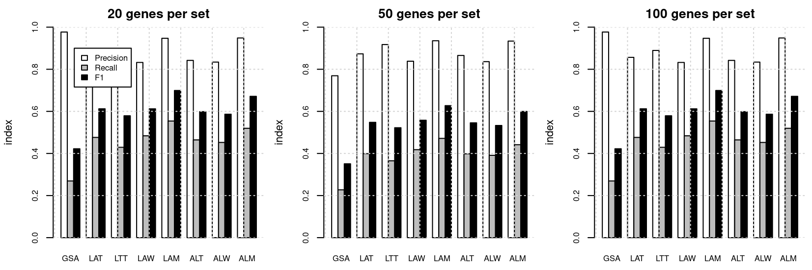
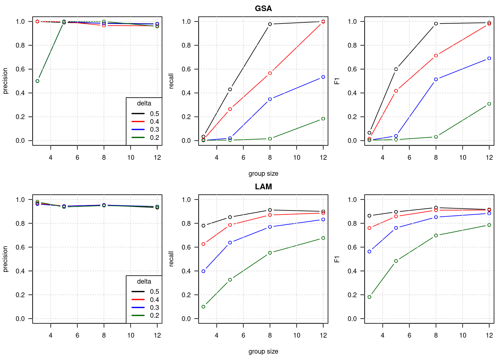
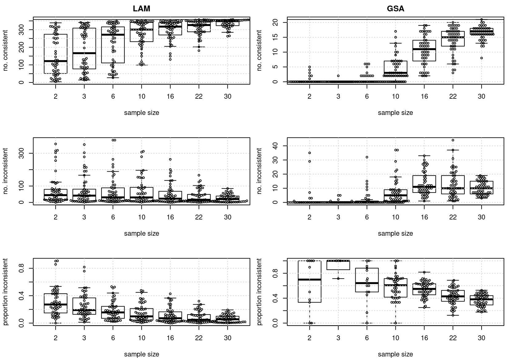

<strong>
Mark Ziemann1,2*,
Mandhri Abeysooriya2,3,
Anusuiya Bora2,
Severin Lamon3,
Yen Wong4,
Jeffrey Craig4
</strong>

1. Burnet Institute, Melbourne, Australia

2. Deakin University, School of Life and Environmental Sciences, Geelong, Australia.

3. Deakin University, School of Exercise and Nutrition, Burwood, Australia.

4. Deakin University, School of Medicine, Geelong, Australia.

(*) Correspondence: m.ziemann@deakin.edu.au

| Author | ORCID |
| --- | --- |
| Mark Ziemann | 0000-0002-7688-6974 |
| Anusuiya Bora | 0009-0006-2908-1352 |

Source: https://github.com/markziemann/gmea

 

## Abstract

* Infinium methylation beadarrays remain one of the most popular techniques for studying genomic
methylation, but tools for downstream pathways analysis remain limited.

* Functional class scoring (FCS) is a group of pathway enrichment techniques that involve the ranking of
genes and evaluation of their collective regulation in biological systems.

* Here we propose three different approaches to apply FCS to Infinium data, which vary upon when the
differential methylation analysis is conducted, at the level of probes, genes or gene sets.

* Using real EPIC array data, we demonstrate that aggregation of probe methylation to gene level before
differential methylation analysis yields a high degree of true positives and low number of contradictory
results.

* Using matched RNA-seq data we evaluate the relationship of methylation differences at promoters and
gene bodies with RNA expression at the level of pathways.

* We apply this approach to two further contexts, where existing methods failed to identify any
pathway-level effects in 450K and EPIC datasets: (i) the effect of assisted reproductive technology on
DNA methylation, and (2) the association of elevated plasma homocysteine with methylation patterns.

* The methods described here have been incorporated into a package called gmea, short for gene
methylation enrichment analysis.

**Keywords:** Pathway analysis, functional enrichment analysis, Infinium Array, DNA methylation,
epigenetics.

 

## Introduction

* DNA methylation is the most widely studied epigenetic mark, for its role in development and
disease.

* Many hundreds of epigenome-wide association studies (EWASs) are conducted each year to understand DNA
methylation patterns in disease and other contexts.

* Infinium arrays remain the preferred platform for EWASs due to low cost and analytical simplicity
as compared to high throughput methylation sequencing.

* Infinium arrays typically have multiple probes per gene in different locations including promoters,
CpG islands, gene bodies and enhancers, which complicates downstream functional enrichment analysis,
otherwise known as pathway analysis or gene set enrichment analysis.

* Enrichment analysis comes in two popular types; over-representation analysis (ORA) and functional
class scoring (FCS).

In ORA, genes with probes that meet an arbitrary significance threshold are selected and compared
to a background list consisting of genes measured in the assay.
The test seeks to identify sets of genes (eg: ontologies, pathways) that are over-represented in the
gene list of interest relative to the background.

Functional class scoring takes a different approach by ranking all detected genes by a differential
regulation score (eg: fold change, confident effect size) followed by a test to assess whether each
set of genes has distribution of scores that is different to the null.
Currently there are no specialised approaches for the application of FCS to Infinium array data.

* Here, we systematically evaluate different approaches to apply FCS to Infinium array.

* Due to the fact that genes have many probes, there are many concevable ways that FCS could be applied
to Infinium Methylation data.

* Method group 1: Limma is performed on the probe level and the probes beloning to each gene are scored
and these scores are aggregated to the gene level.
The gene scores undergo an enrichment test.

* Method group 2: The probe methylation values beloning to each gene are aggregated before differential
methylation analysis with limma.
Then, differential methylation results for each gene are scored, followed by an enrichment test.

With the above, there are options for how the aggregation steps are done, whether parametric or
non-parametric tests are used and whether the enrichment tests are self-contained or competitive.

To determine the best approach to applying FCS to Infinium methylation data, in this study we use
simulated data.
The proposed FCS methods are also compared against existing ORA methods.

## Methods

### Implementation overview

Functional enrichment analysis is a process of data summarisation from genes to gene sets (pathways).
This is made more complicated for Infinium array data due to the presence of multiple probes per gene,
meaning the data needs to be summarised from probes to genes and then to gene sets.
Here, we outline seven potential approaches for FCS of Infinium methylation data:

1. Limma Average t-test (LAT).
Differential methylation analysis is conducted at the probe level with limma, and the limma
t-statistics for each gene are summarised (mean).
The mean t-statistics are used in a downstream two-sample two-way t-test of gene set enrichment.

2. Limma Top t-test (LTT).
As above, except instead of calculating the mean t-statistic, the probe with the largest magnitude is selected
to represent the gene.

3. Limma Average Wilcox (LAW).
Similar to LAT, except instead of the two-sided t-test of gene set enrichment, a non-parametric alternative,
the Wilcoxon signed-rank test.

4. Limma Average Mitch (LAM).
Similar to LAW, however instead of the Wilcoxon test, the Mitch package is used to execute a two-way,
two-sample ANOVA-on-ranks test (Kruskal Wallis).

5. Aggregate Limma t-test (ALT).
In this method, all probe measurements beloning to each gene are averaged before conducting differential
methylation andlysis with limma.
The limma t-statistics are then used downstream for enrichment analysis with the two-sample two-way t-test.

6. Aggregate Limma Wilcox (ALW).
Similar to ALT, however it uses the Wilcoxon non-parametric test for gene set enrichment.

7. Aggregate Limma Mitch (ALM).
Similar to ALW, however uses the Mitch package to execute a two-way, two-sample ANOVA-on-ranks test
(Kruskal Wallis).

The above were compared to a standard ORA based approach (GSA), which involves limma on probes, selection of
statistically significant probes (FDR<0.05) for ORA with the `GSAmeth()` function of missMethyl which conducts a
modified hypergeometric test that accounts for multiple probe biases.
In the case that fewer than 250 significant probes are identified, then 250 probes with the smallest p-values
were selected.

### Method validation

To assess these methods, we adopted a simulated data approach.
EPIC Infinium array data derived from non-cancerous lung tissue of 37 cancer patients was used for our
evaluations (GSE158422).
We downloaded raw intensity EPIC IDAT files from GEO for study GSE158422 which consists of
lung tumour and normal adjacent tissues from 37 patients.
Probe annotations were obtained from the "IlluminaHumanMethylationEPICanno.ilm10b4.hg19" Bioconductor
package.
We randomly sampled datasets to serve as control and cases (no replacement), with group sizes varying between
3 and 12.
One thousand random gene sets were created with sizes varying between 20 and 100 members.
Random gene sets were used to avoid problems caused by the large overlap among real gene sets.
Throughout our evaluations, 50 gene sets were selected to be differentially methylated, 25 with increased and 25
with decreased methylation.
From these gene sets, half of the member genes were selected.
For those selected genes, half of the annotated probes were selected.
We adjusted the m-values in the case group by a specified amount, which we call the "delta", which we varied
between 0.1 and 0.4.
Following the incorporation of methylation changes to selected probes in the case group, the data underwent
limma differential methylation analysis, followed by enrichment analysis using `GSAmeth` approach, or one of
the seven FCS methods outlined above.
Enrichment results were then filtered for FDR<0.05 and correct direction of methylation change.
Differentially methylated gene sets observed were compared to gene sets selected to be the ground truth, so that
the number of true positives (TP), false positives (FP) and false negatives (FN) could be determined.
At each setting for group size, delta and gene set size, 50 replications were conducted each with a set seed
to ensure reproducibility.
Mean TP, FP and FN values were determined, and then precision, recall and F1 scores were calculated.

### Sensitivity analysis

The same dataset including all 37 patients underwent pathway enrichment analysis using the GSAmeth and LAM methods
with Reactome pathways downloaded from MSigDB website (version 2023.1).
Euler diagrams were created with the `eulerr` R package.
Then, a random subset of n patients was selected followed by pathway enrichment analysis with the
respective method, with n varied between 2 and 30.
The subset results were compared to the full n=37 results to test the sensitivity of these enrichment
methods at differenent effect size levels, and whether findings at a smaller sample size were consistent with the full group.
This process was repeated 50 times.

### Association of methylation with gene expression

RNA-seq based gene counts for the same set of lung cancer patients were downloaded from GEO [GSE158420](https://www.ncbi.nlm.nih.gov/geo/query/acc.cgi?acc=GSE158420).
HGNChelper was used to repair transmogrified gene names, followed by DESeq2 based differential analysis.
This underwent filtering to remove genes with expression below 10 reads per sample on average across the dataset.
Then DESeq2 was used to compare normal and cancerous tissue gene expression taking into consideration sample pairing.
The differential expression results underwent enrichment analysis using the mitch package with default settings for DESeq2 data tables.
CpG sites annotated as promoters were considered separately from those located at gene bodies in mitch analysis.
For comparison, GSAmeth was used to separately examine pathways using separate analyses of promoter and gene body CpGs.
For this analysis, Reactome gene sets were used.
Subsequently, to generate the mitch heatmap, we used mitch in multivariate mode by analysing differential RNA expression,
promoter and gene body methylation together, prioritising the results by s-distance, a surrogate measure of effect size.

### Pathway-level differential methylation in assisted reproductive technology
(i) the effect of assisted reproductive technology DNA methylation

### Pathway-level differential methylation in hyperhomocysteinemia
(2) the association of elevated plasma homocysteine with methylation patterns.

## Results

### Evaluation of FCS methods for Infinium methylation array data

Simulations were conducted using the seven FCS methods (LAT, LTT, LAW, LAM, ALT, ALW, ALM) and GSAmeth,
with group sizes of 3-12 and delta values between 0.1 and 0.5, and random gene sets with sizes 20, 50
and 100.
True positives, false positives and false negatives were used to calculate overall precision and recall
at these three gene set sizes (**Figure 1**).
We found that overall recall was positively associated with the size of the gene sets considered.
At 20 genes per set, GSA had the highest overall performance, with F1 of 0.097, followed by LAM with 0.035.
At 50 genes per set, LAM achieved an F1 value of 0.29, while GSA scored 0.19.
At 100 genes per set, LAM showed the highest F1 performance of 0.56 followed by ALM with 0.53, while
GSA scored only 0.24.
This result suggests that FCS methods perform better than ORA with gene set sizes >50.

Performance results for GSA and LAM methods with 100 genes per set shows that precision was similar, with most simulations yielding
>95% precision (**Figure 2**).
LAM recall was superior for most simulations, particularly with lower group sizes.
Taken together, this result suggests that LAM offers improved sensitivity over existing approaches when
the gene sets are larger than 50 members.

### Sensitivity of GSA and LAM methods with real cancer data

Next, GSA and LAM methods were applied to compare paired normal and cancer methylation data from 37 lung squamous cell carcinoma patients.
From the 839,473 probes examined, 473,572 probes were considered significant at 5% FDR.
Of these, 119,785 probes were significantly hypermethylated and 353,787 were significantly hypomethylated.
These significantly hypermethylated probes mapped to 16,520 unique genes, while the hypomethylated probes mapped to 24,114 genes.
These numbers are large, considering that there are 26,219 genes represented on this array.

LAM resulted in 358 significant Reactome pathways at FDR<0.05 while there were just 21 with GSA (**Figure 3A**).
The overlap of significant pathways was unexpectedly small, with just five common pathways.

We were curious about whether LAM method had a bias towards larger gene sets as the recall of this
method is higher with larger gene sets.
Unexpectedly, pathways identified by LAM were collectively smaller than GSA (**Figure 3B**).
Although algorithmic accuracy cannot be inferred from the types of pathways identified in real data,
top ranked results from LAM appeared to be more related to cell differentiation, identity and development (**Figure 3C**),
as compared to GSA (**Figure 3D**).

To compare the sensitivity of these methods with real data, sample sizes were randomly downsampled, analysed
as above and the significant pathways were compared to the results from the full
group of 37 patients.
This process was repeated 50 times and the results shown in (**Figure 4**).
Pathways that were identified in the smaller and full group were termed "consistent",
while pathays that were identified in the smaller but not in the full group were
termed "inconsistent".
LAM was able to detect 300 out of 358 consistent pathways with a sample size of 10,
while GSA detected just 4 of 21 at this sample size.
LAM identified more inconsistent pathways than GSA, but the proportion of
inconsistent findings was lower across all sample sizes.
At a sample size of 10, the proportion of inconsistent pathways was 10% for LAM and
60% for GSA.
This result suggests that LAM has superior sensitivity to detect differentially methylated
pathways in real cancer data.

## LAM and GSA integrative analysis with RNA expression

Associations of epigenetic marks with gene expression are of great interest for understanding disease processes.
Matching tumour-normal RNA-seq datasets were analysed and we conducted enrichment analysis of gene expression together with
DNA methylation.
There were 12,386 differentially expressed genes (FDR<0.05), with 7,418 and 4,968 up- and down-regulated in the tumour group respectively.
At the pathway level there were 318 and 193 up- and down-regulated Reactome pathways with altered gene expression (FDR<0.05).
As the context of gene methylation is important in influencing gene expression, promoter and gene body methylation
were considered separately.
In promoters, GSA identified 15 and 8 pathways with higher and lower methylation respectively, while at gene bodies, there were were 17 and 67
pathways with higher and lower methylation respectively (FDR<0.05).
Using LAM, there were 133 and 12 pathways identified with higher and lower promoter methylation respectively, while there were 236 and 35 with higher and lower gene body methylation respectively (FDR<0.05).
The relative overlap between promoter and gene body results was larger for LAM pathway sets as compared to GSA (**Figure 5A,B**).
There was no observed overlap between GSA methylation-based pathways and gene expression pathways (**Figure 5A**), but there were some
overlaps between pathways identified with LAM based promoter and gene body methylation and gene expression (**Figure 5B**).
Interestingly, 123/318 upregulated gene expression pathways were associated with increasing gene body methylation with LAM.
Likewise 19 pathways with downregulated expression were associated with increasing promoter methylation.
Some of these pathways with large effect sizes across the three contrasts are depicted in heatmap form (**Figure 5C**).
Of these selected pathways, there was a mixture of concordant and discordant signatures in the three contrasts,
suggesting that promoter methylation differences do not strongly influence RNA expression at the level of pathways.
However there were a small number of pathways that did exhibit what could be epigenetic influences, for example
"DNA strand elongation", "Unwinding of DNA", "Mucopolysaccharidoses" and "Interaction with cumulus cells and the zona pellucida"
demonstrated an inverse relationship between promoter methylation and gene expression.
These results demonstrate that LAM can illuminate the complicated relationship between DNA methylation and gene expression at the pathway level in cancer.

## Exploration of methylation pathways in aging

We sought to explore the utility of LAM for exploring large EWAS datasets.
One of the best studied associations with DNA methylation is with chronological aging, although
pathway level differential methylation is not well defined.
Using summary statistics from independent discovery and replication studies using the EPIC array platform described
by McCartney et al (2020), we applied mitch to explore the pathway level differential methylation.
In the discovery cohort we observed XX differential pathways (FDR), while in the replication group we observed XX.
There was a high degree of agreement, with XX pathways significant in both groups.
This is not surprising, as the gene-level differential methylation scores show a strong positive association between discovery and replication studies (**Figure 6A**).
Using the MANOVA test, we identified XX pathways with altered methylation, most of which were concordant between
discovery and replication (**Figure 6B**).
When prioritising the results by S distance, a surrogate measure of effect size, 29 of the top 30 pathways were concordant in their direction of regulation (**Figure 6C**).
Some of the observed methylation changes make sense with reports in the literature.
For example the complement pathway is associated with aging and in this analysis we observe a reduction in methylation of genes beloning to this set including *C1R*, *MBL2*, *C1S* and *C1QC* (**Figure 6D**).

![Figure 6. Pathway level DNA methylation alterations with chronological age. (A) Contour heatmap showing the similarity in gene methylation score ranks in the discovery and replication studies.
(B) Mitch pathway enrichment scores (S distances) in discovery and replication studies. Pathways with MANOVA FDR<0.05 are shown in red while others are shaded gray.
(C) Heatmap of 30 pathways with most extreme S distances (a surrogate of effect size). Red indicates increasing methylation and blue shows lower methylation.
(D) An example of a pathway identified with this method, "creation of C4 and C2 activators" shows lower methylation of member genes in both discovery and replication studies.
](../figs/fig6.png)

## Exploration of methylation pathways altered by IVF

Another application for this method is the joint pathway enrichment analysis of studies conducted with different
array systems.
Epigenetic differences between infants conceived naturally and with assisted reproductive technologies have been the subject of studies since 20XX (eg: REFS).
Two of the highest powered studies are Estill 2016 which used the 450K array and Novakovic 2019 study which used
the EPIC array.
Joint enrichment analysis can uncover pathways that are common or different between these studies and illuminate
the biological differences between conception groups.
For this example we focused on comparing naturally conceived infants to those conceived with in vitro fertilisation with fresh embryo transfer.
The Estill dataset on 450k had 418,833 probes that met the quality criteria (Natural n=43; IVF n=38).
Of these, 149,552 probes showed statistical significant differential methylation (FDR<0.05), of which 28,637 and 120,885 exhibited higher or lower methylation in the IVF group respectively.
The Novakovic dataset on EPIC array had 810,518 probes that met the filtering criteria (n=133).
Of these, 5,491 were statistically significant (FDR<0.05) with 1,326 and 4,165 exhibited higher or lower methylation in the IVF group respectively.
After summarisation to the gene level, the Estill dataset on 450k array describes 19,951 genes, while the
Novakovic dataset on EPIC array describes 26,150 genes.
There were 19,942 genes common to both platforms.
The rank-rank plot indicates a high degree of overlap overall, and interestingly shows a trend of more genes having lower methylation level in the IVF group (**Figure 7A**).
A scatterplot of pathway enrichment scores indicates a high degree of agreement between these studies at the level of pathways despite they being conducted years apart and analysed with different array systems (**Figure 7B**).
The heatmap shows a high degree of agreement with pathways with a higher level of methylation in the IVF groups,
while pathways with overall lower methylation in the IVF group showed some variability in enrichment scores
between studies (**Figure 7C**).
We were interested in which pathways had consistently lower methylation in the IVF group and identified the Reactome pathway "Nuclear kinase and transcription factor activation events" which had enrichment scores of -0.26 in both contrasts and a MANOVA FDR value of 0.002 (**Figure 7D**).
Top ranked genes from this pathway include *FOSL1*, *JUNB*, *ASCL1* and *ID1*.
A loss of methylation of these genes could contribute to disorders of development.
Taken together, this analysis shows that LAM method can be used to compare enrichment of independent studies
conducted with 450k and EPIC arrays.

![Figure 7. Pathway level DNA methylation differences in natural and IVF conceived infants. (A) Contour heatmap showing the similarity in gene methylation score ranks in the Estill (450k) and Novakovic (EPIC) studies.
(B) Mitch pathway enrichment scores (S distances) in Estil and Novakovic studies. Pathways with MANOVA FDR<0.05 are shown in red while others are shaded gray.
(C) Heatmap of 30 pathways with most extreme S distances (a surrogate of effect size). Red indicates higher methylation and blue shows lower methylation.
(D) An example of a pathway identified with this joint enrichment analysis method, "Nuclear kinase and transcription factor activation" shows lower methylation of member genes in both Estill and Novakovic studies.
](../figs/fig7.png)

## Discussion

## Bibliography
